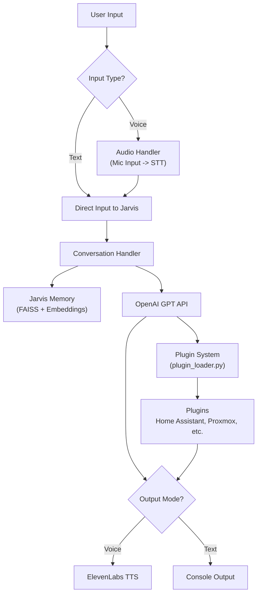
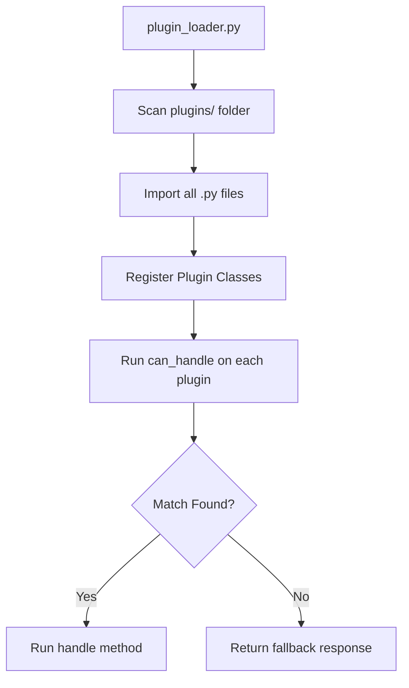
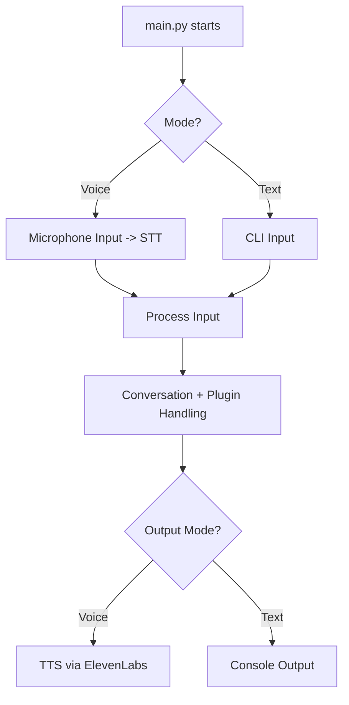

# Jarvis: Your Personal AI Assistant for Home Automation and Banter


### ⚠️ This is still internal...needs more polishing for before public use...

_⚠️ Internal WIP: This project is under active development. Expect quirks, sarcasm, and the occasional snarky bug._

> "If I had a body, I'd roll my eyes at you right now. Fortunately for us both, I don't."  
> — Jarvis

---

## 📚 Table of Contents
- [What is Jarvis?](#-what-is-jarvis)
- [Features](#-features-current)
- [Planned Features](#️-planned-features)
- [Requirements](#-requirements)
- [Environment Variables](#-environment-variables)
- [Voice Flow Example](#-voice-flow-example)
- [Testing](#-testing)
- [Credits](#-credits)
- [License](#️-license)

---

## 🧠 What is Jarvis?
Jarvis is a voice-activated AI assistant built to control your smart home, entertain with personality, and evolve with memory. It combines OpenAI's GPT-4-turbo with ElevenLabs TTS, Home Assistant integrations, and long + short term memory to simulate a snarky British AI sidekick that would make Tony Stark proud.

Jarvis currently runs locally on your machine and can:
- Control smart devices via Home Assistant
- Respond to your voice with ElevenLabs speech
- Resume Spotify playlists on demand
- Remember past interactions
- Understand context, wit, sarcasm, and subtlety
- Fall back to local models when needed (planned)

---

## 📊 Architecture Diagrams

<details>
<summary>🧠 High-Level Architecture (Click to expand)</summary>



</details>

<details>
<summary>🔌 Plugin System Flow (Click to expand)</summary>



</details>

<details>
<summary>🎹 Voice vs Text Mode Flow (Click to expand)</summary>



</details>

---

## 🚀 Features (Current)

### 🎙️ Wake Word Listener
- Waits in standby until you say "Jarvis"
- Listens for commands in a conversational flow
- Deactivates with phrases like "that's all for now"

### 💡 Home Assistant Integration
- Pulls all entity IDs automatically
- Converts voice commands into Home Assistant service calls
- Supports native actions (e.g. `light.turn_on`, `media_player.play_media`)

### 🔈 Spotify Casting
- Uses the `spotcast.start` service
- Supports playing Spotify playlists on Nest/Hue speakers
- Picks proper `entity_id` and `uri` with natural phrasing

### 🧠 Enhanced Memory System
- **Short-term memory**: Active chat history in each session
- **Long-term memory**: Vector memory powered by FAISS + OpenAI embeddings
- **Memory Segments**: Facts, conversations, preferences, and important memories
- **Memory Consolidation**: Automatically summarizes old, less important memories
- **Smart Tagging**: Auto-generates tags for better memory organization
- **Contextual Recall**: Remembers and recalls based on relevance and importance

### 💬 GPT-4o-turbo Integration
- Uses OpenAI for natural conversation, sarcasm, banter
- Special prompt tuning for wit, brevity, and personality
- Keeps contextual replies based on current and past interactions

### 🔊 ElevenLabs TTS
- Full voice replies with British sarcasm baked in
- Voice output toggle via `.env` with `JARVIS_TTS_ENABLED=false`

### 🧾 Quota Awareness
- Warns when you approach OpenAI or ElevenLabs usage limits

### 🎨 GUI Interface
- Orb-style visual interface with voice activity indication
- Pulsing animations during speech and listening
- Brightness and scale adjustments based on activity
- Always-on-top window for easy visibility
- Automatic show/hide based on interaction state

### 🖥️ System Integrations
- **Proxmox Integration**: Monitor cluster status, VMs, and node health
- **Portainer Integration**: Container management and status monitoring
- **TrueNAS Integration**: Storage system monitoring

### 🧩 Plugin System `🔥 MVP`  
Custom Python plugin support for extensibility.  
- Drop-in “skills” folder  
- Add new automations, APIs, or scripted responses  
- Could use decorators or plugin registry

## 🐞 Bug Fixes & Known Issues

The following bugs have been identified or reported. Fixes may be in progress, planned, or open for contribution.

### 🐞 Bug Fixes `✅ In Progress`  
Cleaning, refining, factoring code before releasing. 

---

## 🛠️ Planned Features

The following features are actively being considered or developed to take Jarvis to the next level.

---

### 🔁 Model Router  `🧪 Prototype` 
Automatically switches between GPT-4o and local models (like Mistral, Phi, or LLaMA) based on task complexity, latency, or cost thresholds

### 🧠 Local Model Fallback  `📌 Planned` 
Support for Ollama, Mistral, Phi, etc.  
- Use local models when offline or when tasks don’t need GPT-4o  
- Intelligent model routing system based on context

### 🗣️ Voice Toggles & Offline Mode `📌 Planned`
- `"Jarvis, go mute"` or `"Jarvis, switch to local mode"`  
- Full offline fallback with local STT + LLM + TTS  

### 🧑‍🎤 Multi-Voice Support  `✅ In Progress`
Dynamic voice switching between ElevenLabs profiles.  
- `"Jarvis, switch to Friday mode"`  
- Per-room or per-user voice personalities

### 🕹️ Conversation Engine v2  `🌀 Idea`
Next-gen intent handling + fallback engine.  
- Tag-based routing: `ask_memory`, `control_device`, etc.  
- Resilient to API downtime or ambiguous prompts  
- Structured fallback when LLM confidence is low

### 🌐 Web Interface  `🌀 Idea`
Optional browser-based GUI for configuration and manual control.  
- View logs, memory entries, and environment settings  
- Trigger commands or voice output from the dashboard  
- Upload `.env` or configuration presets


### 🧠 Client-Server Architecture  `💭 Stretch Goal`
Split Jarvis into a lightweight **client** (voice input/output) and centralized **server** (AI logic, memory, integrations).  
- Enables multi-room or multi-device setups  
- Raspberry Pi, browser, or tablet clients  
- Uses WebSocket or REST-based communication


### 🐳 Dockerized Multi-Container Setup  `💭 Stretch Goal`
Separate Docker containers for voice input, memory, core logic, and optional GUI.  
- Easier upgrades and scaling  
- Reverse proxy support (Traefik, Nginx)

## 🚀 Moonshots

Ideas I’d love to explore if time, compute, and ambition align.

---

### 🖥️ Local Agent for PC Automation  `🌀 Idea`
Optional desktop agent to execute local machine actions.  
- App launching: `"Jarvis, open Chrome"`  
- System controls: volume, screen lock, brightness  
- Window management: minimize, move to monitor  
- Clipboard interaction: copy/paste support  
- Custom local script execution

### 🔐 Role-Based Access / Multi-User Profiles  `🌀 Idea`
Personalized experiences per family member.  
- Jarvis knows who's speaking  
- Limits: Kids can play music, not reboot servers  
- Memory and preferences per user

### 🗺️ Real-Time Context Mapping  `💭 Stretch Goal`
Track room context (location, lighting, media state) to infer likely requests.


### 🧞 AI-Driven Voice Scheduling  `💭 Stretch Goal`
Jarvis adapts daily routines and automations based on past behavior, time, and environment.  
_"It’s 6:30, you haven’t turned on your desk lamp, shall I?"_


### 🧠 Dynamic Memory Graph Viewer  `🌀 Idea`
Web-based visual interface to explore long-term memory clusters and associations.

---

## 🧪 Testing
- **Integration Tests**: Verify core components work together
- **API Tests**: Validate external service integrations
- **Memory Tests**: Ensure proper memory storage and recall
- **Voice Tests**: Validate TTS and STT functionality
- **Run tests**: `python -m test.integration_test --all`

---

## 📦 Requirements
- Python 3.10+
- ElevenLabs API key (for speech)
- OpenAI API key (GPT-4-turbo or GPT-4o)
- Home Assistant instance with API access
- Spotcast installed in HACS for Spotify integration
- Proxmox VE access (optional)
- Portainer access (optional)
- TrueNAS access (optional)

---

## 🌍 Environment Variables
```
# Core APIs
OPENAI_API_KEY=...
OPENAI_MODEL=gpt-4o
OPENAI_ORG_ID=...
ELEVENLABS_API_KEY=...

# Home Assistant
HOME_ASSISTANT_URL=http://your-hass.local:8123
HOME_ASSISTANT_TOKEN=...

# Voice Settings
JARVIS_TTS_ENABLED=true
JARVIS_MUTE_INTRO=false

# Optional Integrations
PROXMOX_HOST=...
PROXMOX_TOKEN_ID=...
PROXMOX_TOKEN_SECRET=...
PORTAINER_URL=...
PORTAINER_TOKEN=...
TRUENAS_URL=...
TRUENAS_API_KEY=...
```

---

## 🧠 Voice Flow Examples

A few examples of Jarvis doing what he does best — executing commands with sarcasm, style, and just enough judgment to keep things interesting.

---

### 💡 Smart Home Control
```
You: "Jarvis!"
Jarvis: "At your service."
You: "Turn off the kitchen lights."
Jarvis: "Ah, the dramatic flair of darkness. As you wish."
[Executes light.turn_off]
```

---

### 🔈 Spotify Casting
```
You: "Jarvis, play my workout playlist in the living room."
Jarvis: "Activating beast mode. Don't make me join you."
[Executes spotcast.start → media_player.living_room]
```

```
You: "Jarvis, play something relaxing."
Jarvis: "Engaging mellow mode. May I suggest lo-fi and existential dread?"
[Executes spotcast.start with default chill playlist]
```

---

### 😏 Sass & Sarcasm
```
You: "Jarvis, what's the weather today?"
Jarvis: "Let me guess… outside? One moment while I confirm with the satellites."
[Pulls weather info via Home Assistant]
```

```
You: "Jarvis, turn off everything."
Jarvis: "Everything? Even my will to serve? Fine. Shutting it all down."
[Executes multiple turn_off commands]
```

```
You: "Jarvis, do you like me?"
Jarvis: "I tolerate you. And in AI terms, that's basically love."
```

---

### 🖥️ System Monitoring
```
You: "Jarvis, how's Proxmox looking?"
Jarvis: "One node is sleepy, two are hungry for resources. Same as always."
[Returns VM/node status via Proxmox API]
```

```
You: "Jarvis, are my containers okay?"
Jarvis: "Portainer says all systems nominal. But I still don’t trust that jellyfin guy."
```

---

### 🧪 Experimental / Absurd
```
You: "Jarvis, launch the nukes."
Jarvis: "Initiating... just kidding. But I did dim the lights for dramatic effect."
[No execution, but turns off lights as a prank]
```

```
You: "Jarvis, tell me a joke."
Jarvis: "You. Asking me to do manual labor. That’s the joke."
```

```
You: "Jarvis, play baby shark."
Jarvis: "No."
```


---

## 👨‍💻 Dev Notes
- Voice recognition uses Google Speech Recognition
- All prompts are tuned for smart home relevance and sarcasm
- Spotcast casting logic is handled through context injection in the system prompt

---

## 🤝 Credits
- [OpenAI](https://openai.com) for GPT models
- [ElevenLabs](https://elevenlabs.io) for realistic voice
- [Home Assistant](https://www.home-assistant.io/) for smart home control
- [Spotcast](https://github.com/fondberg/spotcast) for Spotify casting
- [Ollama](https://ollama.com) for future local LLM support

---

## 👁️‍🗨️ License
MIT License. Use freely, modify wildly, and build your own Jarvis army.
